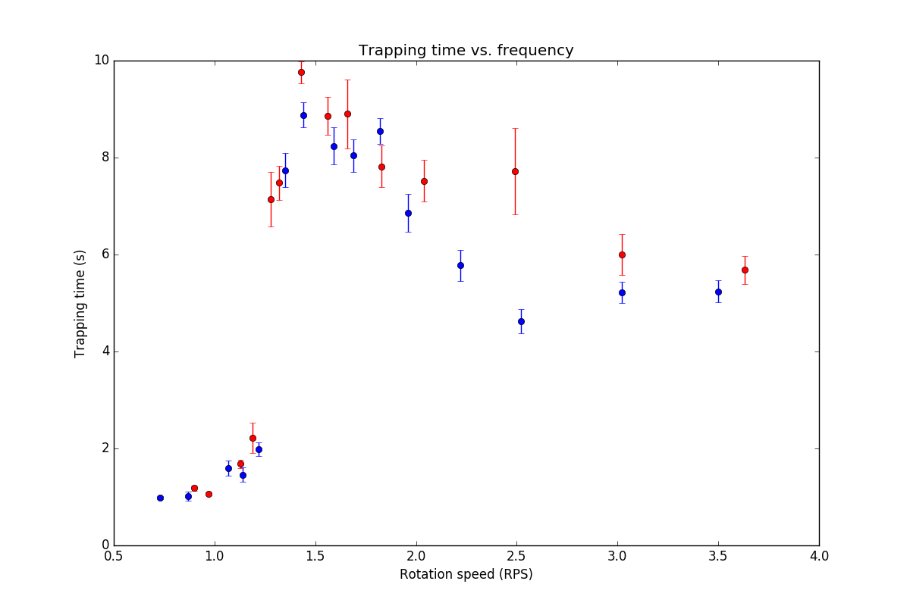
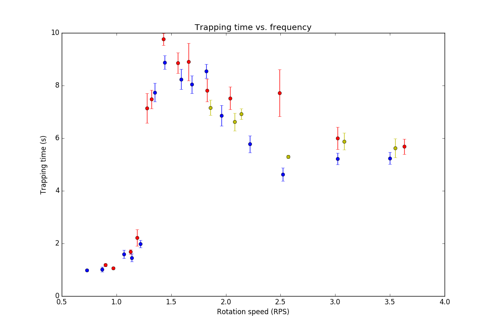

Readme file for saddle project.

Prior work is documented [here](https://roberthart56.github.io/SCFAB/SC_lab/Projects/rotating_saddle/index.html)

**Dec 7-9.** 

Data below uses:
 - Five readings per data point.  Error bars give SD on the mean = SD/sqrt(5).
 - Bare sanded wood saddles.  One is slightly positive (red) and one slightly negative (blue).
 - Levelled saddles, on three bearings.
 - 19mm Polyethylene ball, released at center.
 

[Jupyter Notebook for Dec. 7, with data for the two cases.](./Measurements/Dec7_data_nb.ipynb)

The difference at 2.5 RPS is probably significant.  Also consistent with earlier (10/30/20) results with a larger ball.  Any theoretical reason for this?

Next steps:
 - Explore role of friction.  Teflon coating, teflon ball, coated wood, steel ball.  Compare lifetimes at ~1.5 RPS
 - Go back and check 3D printed surfaces.  They may be adequate.  It would be nice to report in the paper that this method works.
 - Explore other low friction non-rolling alternatives.
 - Do a careful measurement of z(x,y) for all surfaces.
 - Design a launcher, to minimize and/or characterize dependence on initial conditions.
 
To answer questions about friction and rolling, how about studying flat plates (acrylic, epoxy, 3D PLA, etc) rotating, with sliding and rolling particles?  Should be able to solve for this motion analytically.  Will that tell us anything about the connection between rolling data and unobtainable sliding data on curved surfaces?

**Dec 10.**

Explored lubricants, cleaning, surface finish.  Kept to f=1.60-1.66 RPS  NB 5 P1
 
* Plain sanded wood (matches data from 12/7) uses later saddle with alpha<1. :
  * Polyethylene 19mm: mean=8.6 SD=0.8
  * PTFE 19mm:  8.4 +/- 1.1
  * Steel 19mm: 10.2 +/- 1.3
  
* Epoxy coated wood, using earlier saddle with alpha>1.:
  * Polyethylene 19mm: mean=10.0 SD=0.8
  * PTFE 19mm:  10.1 +/- 1.0
  * Steel 19mm: 14.7 +/- 1.3
  
Following measurements all use steel ball

* Spray surface with Dry PTFE lubricant: 14.6 +/- 1.3
* Clean saddle, spray ball with dry PTFE: 20.2 +/- 1.2
* Spray surface with Wet teflon lubricant:  7-8 s
* Clean saddle, clean ball IPA: 25 +/- 4.
* Spray ball dry film, dry 5 min: 17 +/- 2.
* Clean ball IPA: 36 +/- 9.
* sand off some bumps, clean IPA; 24 +/- 3.
* Polish to shiny:  33 (N=3)
* Light spray with dry lubricant on saddle:  31 (N=3).
* Clean saddle.  Light spray ball with dry lub:  25 (N=3).
* Clean all with IPA:  32.5 +/- 3.3 N=5.

Conclusion that residual lubricant when cleaned with IPA may help.  No order-of-magnitude changes with lubrication.

  
  
 
Video link:  https://youtu.be/w8pZ9PfglKk  to movie of two  runs 20-30 seconds on clean surface, as at end of above list.

Next steps, after discussion with Louis and Carey:
* Reexamine points >= 2.5 for bare-wood alpha<1 surface.
* Take a good movie, with marked ball with the bare wood surface.
* coat the surface.
* take data again with both surfaces.  Consider how to control initial conditions. Make a launcher.

** Dec11 **

Reexamine points as suggested above, for alpha<1 surface. Figure below shows new points in yellow:

